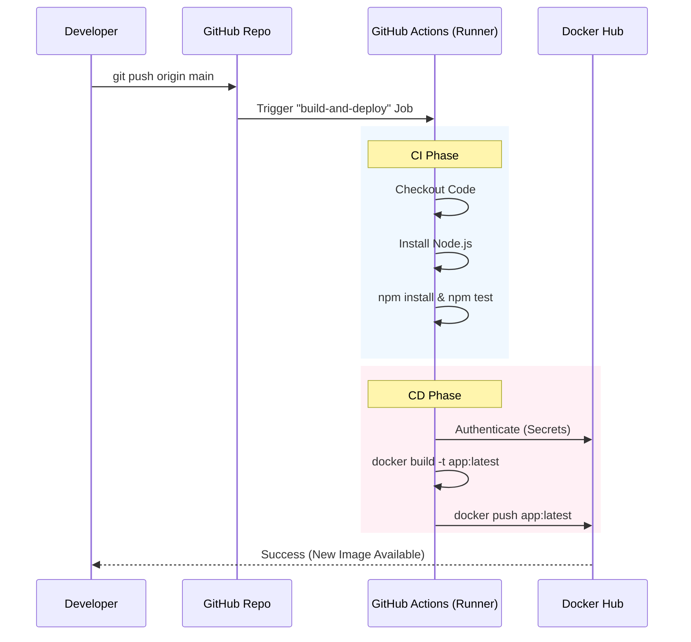

# [Node.js CI/CD Pipeline Automation]

**Date:** February 12, 2026 <br>
**Topic:** Continuous Integration & Deployment (CI/CD)<br>
**Project:** Node.js + Docker + GitHub Actions

## [Project Overview]
This project demonstrates a fully automated
**Continuous Integration and Continuous Deployment (CI/CD)** pipeline using **GitHub Actions**. 
The pipeline is designed to automatically build, test, and containerize a Node.js web application, subsequently pushing the Docker image to **Docker Hub** whenever changes are pushed to the `main` branch.

This project serves as a Proof of Concept (PoC) for automating modern DevOps workflows.

## 1.What? (The Concept)

**What I built?**
I built a **CI/CD Pipeline**. <br> It is an automated workflow that listens for changes in our code repository.<br>
  When code is pushed, it automatically:
  
  1. **Integrates:** Merges code and runs tests to ensure nothing is broken (CI).
  2. **Delivers:** Packages the application into a Docker container and uploads it to a registry (CD).

## 2. Why? (The Purpose)

**Why do we need this automation?**<br>
In a manual world, a developer has to:

1. Write code.
2. Manually run tests on their laptop (which might differ from the server).
3. Build the Docker image manually.
4. Log in and push the image.

**This is bad because:**

* **"It works on my machine":** Environments differ. The CI runner provides a clean, neutral environment.
* **Human Error:** Developers might forget to run tests before pushing.
* **Slowness:** Manual releases take time. Automation is instant.

**The Benefit:** We can now deploy code 50 times a day with confidence. If the tests fail, the image is never built, preventing broken code from reaching users.

## [Tech Stack]
| Component | Technology | Description |
| :--- | :--- | :--- |
| **Source Code** | Node.js (Express) | Simple REST API application |
| **Containerization** | Docker | Packaging app dependencies |
| **CI/CD** | GitHub Actions | Workflow automation engine |
| **Registry** | Docker Hub | Artifact/Image storage |
| **OS** | Ubuntu Latest | Runner environment |

## [Project File Structure]
```
nodejs-demo-app/
│
├── .github/                 # GitHub Actions configuration folder
│   └── workflows/           # Where the automation script lives
│       └── main.yml         # The CI/CD pipeline definition (YAML)
│
├── node_modules/            # Dependencies (Ignored by Git, exists locally)
│
├── .gitignore               # Tells Git to ignore node_modules
├── app.js                 # The main Node.js application file
├── Dockerfile               # Instructions to build the Docker image
├── ERROR_LOG.md             # Your record of bugs and fixes
├── package.json             # App metadata and scripts (start, test)
├── package-lock.json        # Exact version lock for dependencies
└── README.md                # Project documentation for viewers
```

## 3. How? (The Implementation)

**The Workflow Architecture:**




## [Workflow Steps]
<details>
  <summary>Click to view detailed steps</summary>
The pipeline consists of a single job build-and-deploy containing the following steps:

  * Checkout Code: Pulls the latest code from the repository.

  * Setup Node.js: Installs Node.js v18 environment.

  * Install & Test: Runs npm install followed by npm test to ensure code integrity.

  * Docker Login: Authenticates with Docker Hub using secure GitHub Secrets.

  * Build & Push: Uses docker/build-push-action to create the image and push it to the public registry.
</details>


## [Security & Secrets]

Sensitive credentials are never hardcoded.
This project uses GitHub Secrets for security:

  - <kbd>DOCKER_USERNAME:</kbd> Stored securely in repo settings.

  - <kbd>DOCKER_PASSWORD:</kbd> Stored securely in repo settings.

## How to Run Locally
If you wish to run this application on your local machine without the pipeline:

#### Clone the Repo:
git clone [https://github.com/Indra1806/nodejs-demo-app.git](https://github.com/Indra1806/nodejs-demo-app.git)


``` Bash
cd nodejs-demo-app

#Build Docker Image:
docker build -t nodejs-demo-app .
#Run Container:
docker run -p 3000:3000 nodejs-demo-app
```


**Key Steps Taken:**

1. **Containerized** the app using a `Dockerfile`.
2. **Ignored** heavy dependencies (`node_modules`) using `.gitignore`.
3. **Defined** the pipeline in `.github/workflows/main.yml`.
4. **Secured** credentials using GitHub **Repository Secrets**.


## 4. Alternatives? (Other Tools)

GitHub Actions is popular, but it's not the only tool.

| Tool | Type | Pros | Cons |
| --- | --- | --- | --- |
| **Jenkins** | Self-Hosted | Industry standard, highly customizable. | Hard to maintain, requires own server. |
| **GitLab CI** | Integrated | Excellent for GitLab users, very powerful. | Tightly coupled with GitLab. |
| **CircleCI** | SaaS | Very fast, great caching. | Can get expensive for large teams. |
| **Azure DevOps** | Enterprise | Great integration with Microsoft stack. | Complex UI for beginners. |


## 5. Future Improvements? (Next Steps)

To make this pipeline "Production Grade,":

1. **Real Testing:** Replace the "dummy" test with actual unit tests (using Jest or Mocha) to verify code logic.
2. **Linting:** Add a step to check code style (e.g., ESLint) to ensure code quality.
3. **Security Scanning:** Add a step like `snyk` or `trivy` to scan the Docker image for vulnerabilities before pushing.
4. **Versioning:** Instead of just `:latest`, tag images with the Git Commit SHA (e.g., `app:sha-a1b2c3`) so we can rollback to specific versions.
5. **Deployment:** The current pipeline *publishes* the artifact. The next step is to *deploy* it to a server (AWS EC2, Kubernetes, or Azure App Service).


### Quick Commands Reference

* **Check status:** `git status`
* **Add all changes:** `git add .`
* **Commit:** `git commit -m "message"`
* **Push:** `git push origin main`
* **See logs:** Github Repo > Actions Tab > Click Workflow Run.

## [Answers for FAQ / Interview Prep]
#### 1. What is CI/CD?
**CI (Continuous Integration)** is the practice of automating the integration of code changes from multiple contributors into a single software project.<br>
**CD (Continuous Deployment/Delivery**) ensures that code changes are automatically prepared for a release to production.

#### 2. How do GitHub Actions work?
**GitHub Actions** is an event-driven automation platform.<br>
It looks for specific "**_events_**" (like a Push or Pull Request) to trigger "**_Workflows_**" defined in YAML files.<br>
These workflows contain "**_Jobs_**" which are executed by "**_Runners_**."

#### 3. What are runners?
**Runners** are the servers that execute our workflows.<br>
They can be GitHub-hosted (virtual machines provided by GitHub, e.g., ubuntu-latest) or Self-hosted (our own servers).

#### 4. Difference between jobs and steps?
**Jobs**: A set of steps that execute on the same runner.
By default, jobs run in parallel (unless dependencies are set).
<br>
**Steps**: Individual tasks within a job (e.g., "Run a script" or "Checkout code").
Steps run sequentially.

#### 5. How to secure secrets in GitHub Actions?
**Secrets** are encrypted environment variables.<br>
They are created in the repository settings (Settings > Secrets and variables > Actions).<br>
In the YAML file, they are accessed via the <kbd>${{ secrets.SECRET_NAME }}</kbd> syntax and are redacted in logs.

#### 6. How to handle deployment errors?
  - **Logs**: Check the "Actions" tab in GitHub to inspect the logs of the failed step.

  - **Conditionals**: Use if: failure() in steps to send notifications (Slack/Email) when a previous step fails.

  - **Rollbacks**: In a production environment, use strategies like Blue/Green deployment to revert to a previous stable image if the new one fails.

#### 7. Explain the Docker build-push workflow.
  - **Checkout**: Get code.

  - **Login**: Authenticate with the registry.

  - **Build**: Create the image from the Dockerfile.

  - **Tag**: Assign a version tag (e.g., latest or v1.0).

  - **Push**: Upload the tagged image to the registry (Docker Hub).

#### 8. How can you test a CI/CD pipeline locally?
We can use a tool called **Act**.<br>
It allows us to run **GitHub Actions** locally by spinning up Docker containers that simulate the GitHub runner environment.

* [Error_Log](ERROR_LOG.md)
